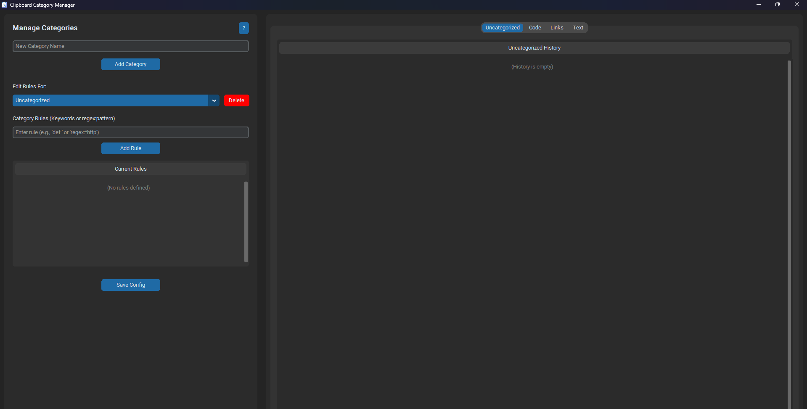

# Clipboard Manager

A simple Windows utility built with Python and CustomTkinter that monitors your clipboard and automatically sorts copied text into user-defined categories based on keywords or regular expressions.



## Features

- **Automatic Clipboard Monitoring:** Runs in the background and listens for new text copied to the clipboard.
- **User-Defined Categories:** Create custom categories (e.g., "Code", "Links", "Notes") to organize snippets.
- **Rule-Based Sorting:** Assign simple keywords or more complex regular expressions (regex) as rules for each category. The first matching rule determines the category.
- **Categorized History:** View clipboard history organized by category in separate tabs.
- **Easy Re-copying:** Quickly copy any item from the history back to the clipboard with a button click.
- **Delete History/Rules/Categories:** Manage your saved items, sorting rules, and categories directly within the GUI.
- **System Tray Integration:** Hides to the system tray when the main window is closed, allowing it to keep running in the background.
- **Persistent Configuration:** Categories, rules, and history are saved to a JSON file (`clipboard_manager_config.json`) and loaded on startup.

## Requirements

- Python 3.x
- Windows OS (due to clipboard/tray libraries used)
- Required Python Libraries (see Installation)

## Installation

1.  **Clone the repository (or download the source files):**
    ```bash
    git clone [https://github.com/your_username/your_repository_name.git](https://github.com/your_username/your_repository_name.git)
    cd your_repository_name
    ```
2.  **Install required libraries:**
    It's recommended to use a virtual environment:

    ```bash
    # Create a virtual environment (optional but recommended)
    python -m venv venv
    # Activate it (Windows)
    .\venv\Scripts\activate
    # Or (Linux/macOS)
    # source venv/bin/activate

    # Install dependencies
    pip install customtkinter clipboard pystray Pillow
    ```

## Running from Source

1.  Make sure you have installed the required libraries (see Installation).
2.  Ensure the icon files (`icon.png` for the tray and `my_icon.ico` for the window) are present in the root directory.
3.  Run the main script from the project's root directory:
    ```bash
    python main.py
    ```
4.  The application window should appear, and an icon will be added to your system tray. The `clipboard_manager_config.json` file will be created automatically if it doesn't exist.

## Compiling to EXE (using PyInstaller)

If you want to create a standalone `.exe` file that can be run on Windows machines without needing Python installed:

1.  **Install PyInstaller:**
    ```bash
    pip install pyinstaller
    ```
2.  **Navigate to the project directory** in your terminal.
3.  **Run the PyInstaller command:**
    - **For a single `.exe` file (slower startup):**
      ```bash
      # Make sure my_icon.ico and icon.png are in the current directory
      pyinstaller --onefile --windowed --icon=my_icon.ico --add-data "icon.png;." --add-data "my_icon.ico;." --name ClipboardManager main.py
      ```
    - **For a folder with faster startup (distribute the whole folder):**
      ```bash
      # Make sure my_icon.ico and icon.png are in the current directory
      pyinstaller --windowed --icon=my_icon.ico --add-data "icon.png;." --add-data "my_icon.ico;." --name ClipboardManager main.py
      ```
4.  **Find the output:** The compiled application will be inside the `dist` folder (`dist/ClipboardManager.exe` or the `dist/ClipboardManager` folder).

    _Note: Compiled executables will be placed in the GitHub Releases section, not directly in the repository._

## Icons

- `my_icon.ico`: Used for the application window and the `.exe` file icon.
- `icon.png`: Used for the system tray icon.

Both icons need to be present when running from source or compiling. They are bundled into the `.exe` during compilation using the `--add-data` flag.

## Configuration

The application saves categories, rules, and history in a file named `clipboard_manager_config.json` located in the same directory where the script or the `.exe` is run. You can manually edit this file, but managing categories and rules via the GUI is recommended.

## Contributing

Contributions are welcome! Please feel free to submit a Pull Request or open an Issue.

## License

[MIT License](https://github.com/pipe1os/clipboard-manager/blob/main/LICENSE)
